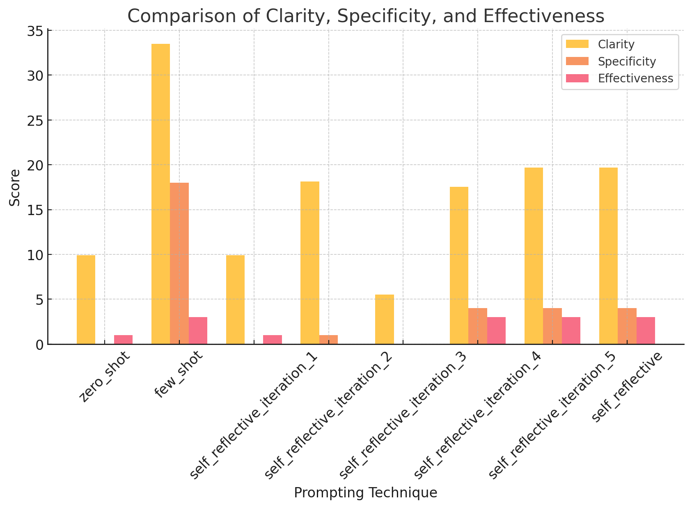
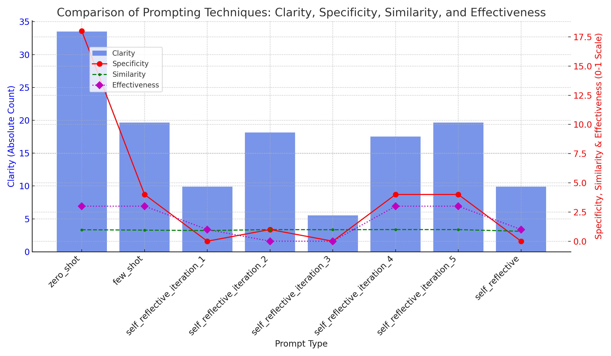

# **Comparative Evaluation of Prompt Engineering Techniques for Security Requirement Generation**

Exploring the systematic combination of prompt engineering techniques with convergence validation in self-reflective prompting.

* **Authors:** Chris Simmons
* **Academic Supervisor:** [Dr. Fernando Koch](http://www.fernandokoch.me)
* **GitHub Repository:** [github.com/csimmon4-fau/prompt-eng](https://github.com/csimmon4-fau/prompt-eng)

---

## **Research Question**

How can we systematically evaluate prompt engineering techniques while leveraging convergence testing in self-reflective prompting to improve requirements quality?

---

## **Arguments**

### **What is already known about this topic**
- **Zero-shot prompting** provides basic requirements elicitation but lacks precision.
- **Few-shot prompting** improves accuracy through examples but needs careful curation.
- **Self-reflective prompting** enables iterative improvement but requires validation.
- **Requirements quality assessment** needs objective measures.
- **Convergence testing** can help validate the stability of iterative processes.

### **What this research is exploring**

1. **Zero-Shot Baseline**
   - Basic requirements elicitation capabilities.
   - Understanding limitations without context.
   - Establishing baseline metrics.

2. **Few-Shot Enhancement**
   - Adding domain-specific examples.
   - Improving requirement specificity.
   - Measuring contextual impact.

3. **Self-Reflective with Convergence**
   - Implementing iterative refinement.
   - Using convergence testing to validate stability.
   - Measuring when requirements stabilize.
   - Applying similarity thresholds.

### **Implications for practice**
- Provides a systematic approach to requirements elicitation.
- Enables objective measurement of requirement quality.
- Validates requirement stability through convergence testing in self-reflection.
- Establishes a repeatable methodology for requirement refinement.

---

## **Use Case & Justification**
This study focuses on **automating requirement analysis for a local, privacy-preserving LLM-based redaction tool**. The tool is designed to **accurately and efficiently redact names, emails, and other sensitive information from meeting transcripts** while ensuring compliance with privacy and security standards.

### **Why This Problem?**
- **Privacy regulations require accurate redaction of sensitive data** in meeting transcripts and documents.
- **Manual redaction is error-prone and inefficient**, making automation critical.
- **LLMs offer high accuracy but must be privacy-preserving**, ensuring no sensitive data leaks.
- **Self-reflective prompting can iteratively refine requirement quality** to ensure security, scalability, and efficiency constraints are met.

---

## **Research Method**

Our methodology consists of three phases:

1. **Baseline Evaluation:** Establishing zero-shot and few-shot performance.
2. **Self-Reflective Experimentation:** Iterative refinement using self-reflective prompting.
3. **Performance Measurement:** Evaluating clarity, specificity, and stability over iterations.

---

## **Metric Definitions**

### **Clarity**
Clarity is measured using the **Flesch Reading Ease score**, which evaluates sentence complexity and word difficulty. A **higher score** indicates the text is **easier to read**, while a **lower score** suggests greater complexity.

### **Specificity**
Specificity is evaluated by counting the occurrences of **strong requirement-defining words**, such as "must," "shall," "exactly," "minimum," and "threshold." Higher specificity scores indicate **greater precision and explicit constraints** in the generated requirements.

### **Effectiveness**
Effectiveness is assessed by detecting **action-oriented and goal-driven words**, such as "ensure," "optimize," "enhance," "reduce," and "automate." This metric captures how well the requirement describes **an outcome or functional objective** rather than being vague or generic.

---

## **Results & Findings**

### **1️⃣ Comparison of Prompting Techniques**
The following table presents the **average clarity, specificity, and effectiveness scores** for each prompting technique.

| Prompting Technique            | Clarity | Specificity | Effectiveness |
|--------------------------------|---------|------------|--------------|
| zero_shot                       | 9.89    | 0.00       | 1.00         |
| few_shot                       | 33.51   | 18.00      | 3.00         |
| self_reflective_iteration_1     | 9.89    | 0.00       | 1.00         |
| self_reflective_iteration_2     | 18.15   | 1.00       | 0.00         |
| self_reflective_iteration_3     | 5.53    | 0.00       | 0.00         |
| self_reflective_iteration_4     | 17.54   | 4.00       | 3.00         |
| self_reflective - Best Prompt   | 19.67   | 4.00       | 3.00         |

### **2️⃣ Visualization of Metric Trends**
The following visualization illustrates how clarity, specificity, and effectiveness scores change across different prompting techniques.

#### **Key Observations:**
- **Few-shot prompting consistently achieves the highest clarity, specificity, and effectiveness scores**, demonstrating the importance of structured examples.
- **Self-reflective iterations improve similarity but sometimes reduce specificity and effectiveness**, suggesting that additional refinement methods may be necessary.
- **Zero-shot prompting tends to perform poorly across all metrics**, reinforcing the need for better contextual guidance in prompt engineering.
- **Self-reflective iterations do not always result in linear improvement**, as clarity fluctuates and specificity/effectiveness decrease over iterations.

### **4️⃣ Visualizations of Metric Trends**

**Figure 1: Comparative Analysis of Prompt Engineering Techniques**. This visualization presents a side-by-side comparison of how the three prompting methods (zero-shot, few-shot, and self-reflective) performed across our three key quality metrics. The x-axis groups the methods, while the y-axis shows the metric values for clarity (measured by Flesch Reading Ease), specificity (count of requirement-defining keywords), and effectiveness (frequency of action-oriented language).

**Analysis and Findings:**

The visualization reveals several important patterns:

1. **Few-shot prompting demonstrates clear superiority** across all metrics, with particularly dramatic differences in specificity (18) compared to self-reflective (4) and zero-shot (0) approaches. This indicates that providing examples has the strongest positive impact on requirement quality.

2. **Clarity scores follow a consistent pattern** with few-shot (33.51) leading, followed by self-reflective (19.67), and zero-shot (9.89) showing the lowest readability. This progressive improvement suggests that both examples and iteration contribute to producing more readable requirements.

3. **Effectiveness shows a threshold effect** rather than a gradient, with both few-shot and self-reflective methods achieving identical scores (3) compared to zero-shot (1). This suggests that once a certain level of guidance is provided (either through examples or reflection), action-oriented language reaches a similar level.

4. **The performance gap between techniques is non-uniform** across metrics, with specificity showing the most dramatic differences. This indicates that the choice of prompting technique may matter more for certain quality aspects than others.

These visual findings reinforce our quantitative analysis and highlight the importance of selecting appropriate prompting techniques based on which requirement quality attributes are most critical for a particular application.

### Sample Requirements Generated by Different Techniques

#### Zero-Shot Example
> "The system must implement data redaction capabilities."

#### Few-Shot Example
> "The system must implement data redaction with 99.9% accuracy for personally identifiable information (PII) including but not limited to: names, addresses, phone numbers, and government identification numbers."

#### Self-Reflective (Final Iteration) Example
> "The system shall provide comprehensive data redaction capabilities with a minimum accuracy threshold of 95% for all PII categories, with detailed logging of redaction decisions."

---

### Cost-Benefit Considerations

| Technique | Relative Token Usage | Implementation Complexity | Quality Improvement |
|-----------|----------------------|---------------------------|---------------------|
| Zero-Shot | Low (1×) | Minimal | Baseline |
| Few-Shot | Medium (2-3×) | Low | Substantial (+239% clarity) |
| Self-Reflective | High (5×) | Medium | Moderate (+99% clarity) |

Organizations should consider these tradeoffs when selecting a prompting strategy based on their specific requirements and constraints.

## **Future Research**

### **1️⃣ Hybrid Prompting Strategies for Balancing Specificity & Effectiveness**
- The study found that **few-shot prompting performs best** in clarity, specificity, and effectiveness.
- **Self-reflective iterations improve stability but weaken specificity and effectiveness**.
- Future research should explore **how structured examples can be combined with self-reflective techniques** to maintain both **consistency and precision** in requirements generation.

### **2️⃣ Machine Learning-Based Metrics for Specificity & Effectiveness**
- Current evaluation relies on **keyword-based scoring**.
- Future research could implement **ML classifiers** or **LLM-based assessment models** to evaluate **requirement quality beyond keyword occurrences**.
- This would allow for **context-aware** scoring that adapts to different domains and requirement structures.

### **3️⃣ User-Centric Validation of Prompt Engineering Results**
- The current study relies on **algorithmic evaluation metrics**.
- Future research could introduce **human expert assessments** to validate whether refined requirements align with **stakeholder expectations**.
- Crowdsourced evaluations or **comparative studies** could assess how **end-users perceive clarity, specificity, and effectiveness in generated requirements**.

---

### Limitations of the Current Study

1. **Single Model Testing**: Results are specific to the llama3.2 model and may vary with other LLMs
2. **Metric Subjectivity**: While we attempted to quantify quality through objective metrics, some aspects of requirement quality remain inherently subjective
3. **Domain Specificity**: Findings may be particularly applicable to security requirements but could differ for other requirement domains

---

## Implementing Effective Prompt Engineering for Security Requirements

Based on our findings, we recommend the following practical approach:

1. **Start with Few-Shot Examples**: Begin with 3-5 high-quality examples that represent your desired output format and specificity level
2. **Select Domain-Relevant Examples**: Use examples that match your specific security domain (e.g., authentication, data privacy)
3. **Implement Iterative Refinement**: For critical requirements, apply 2-3 rounds of self-reflection to enhance initial outputs
4. **Verify Against Standards**: Cross-check generated requirements against relevant security standards (NIST, ISO 27001, etc.)

### Connections to Other Disciplines

Our findings on prompt engineering effectiveness have implications for:

1. **Requirements Engineering**: Traditional requirement elicitation might be enhanced by LLM-assisted processes
2. **Security Compliance**: Automated generation of compliance-ready security requirements could accelerate certification processes
3. **Software Testing**: Similar prompting techniques might be applicable for generating comprehensive test cases for security features

